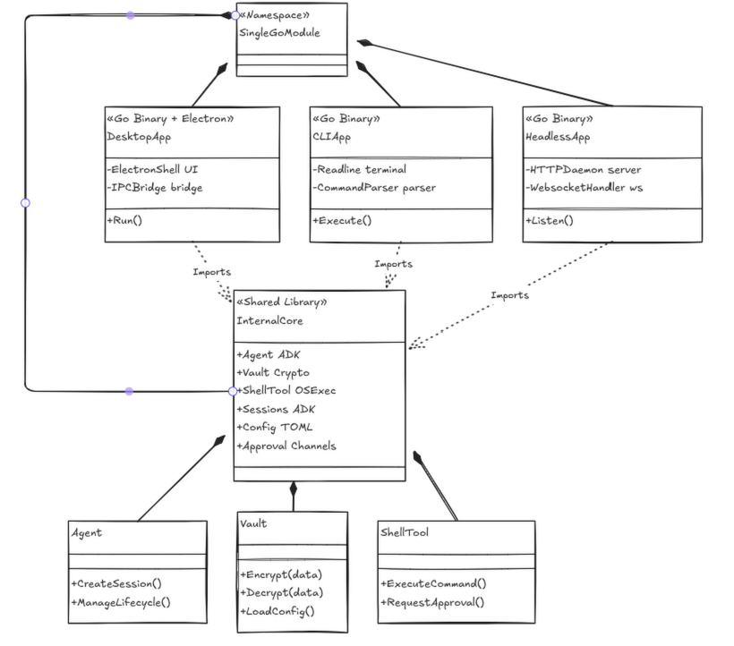

# silo
- why named silo: silo means isolated, contained, secure -- perfect for what we are building. It is the place where people store things, and that metaphor extends to how we treat data, secrets, and execution: everything stays local, everything stays locked down.
- this document covers the V0 of silo to get started. V1 items are marked explicitly.
- TODO: memory part needs further research and finalization for V0.
- this is a high level document to set direction. detailed specs live in their own numbered files.

## TOC
- [silo](#silo)
  - [TOC](#toc)
  - [core philosophies](#core-philosophies)
  - [three modes](#three-modes)
  - [architecture](#architecture)
  - [language](#language)
  - [code style](#code-style)
  - [docs](#docs)
  - [Gateway system](#gateway-system)
  - [llm providers](#llm-providers)
  - [messaging channels](#messaging-channels)
  - [session management](#session-management)
  - [security](#security)
  - [inbuilt cli](#inbuilt-cli)
  - [desktop app](#desktop-app)
  - [ease of setup](#ease-of-setup)
  - [plugin/tools/skill and extension system](#plugintoolsskill-and-extension-system)
  - [configuration system](#configuration-system)
  - [memory and knowledge system](#memory-and-knowledge-system)
  - [media handling](#media-handling)
  - [agent systems](#agent-systems)
  - [comparisons](#comparisons)
  - [strong agentic telemetry and distributed tracing (V1)](#strong-agentic-telemetry-and-distributed-tracing-v1)
  - [web interface (V1)](#web-interface-v1)
  - [task scheduler (V1)](#task-scheduler-v1)

## core philosophies
- a general puropse software which can work as a file system related asistent installed in your software which can do anything which you can do it through your computer or as a general purpose agent added on top of any micro device
- general purpose agent primitives which can be used to extend and build any kind of agent.
- these primitives are useful to test and implement any part of the agent stack.
- note: we are not building a direct consumer-facing tool like clawdbot so we won't go down the route of building a full fledged set of integrations. We provide the core and people build on top.
- leverage the underlying operating system as much as possible.
- security-first approach. Every layer assumes the layer above it is compromised.
- swappable components as much as possible. Interfaces everywhere.
- we provide the local agent primitives and developers can integrate anything in front and build any kind of agent with it.

Think of Silo as having three distinct body parts:

- **The Brain** -- Google ADK Runner + callbacks. The ADK handles the agent loop, tool dispatch, and LLM routing natively. We don't write a custom ReAct loop; we configure one through ADK's runner and register our tools and callbacks. This gives us multi-model support, streaming, and structured tool calling out of the box.
- **The Muscle** -- Shell tool via `os/exec` (V0), Wazero WASM sandbox (V1). In V0 we execute tools by shelling out with allowlists and approval gates. In V1, untrusted tools run inside Wazero (a pure-Go WebAssembly runtime) with fuel metering and capability-based sandboxing.
- **The Vault** -- Same encrypted vault philosophy, implemented with Go crypto libraries. XChaCha20-Poly1305 + Argon2id for secret storage. No `.env` files, no plaintext credentials, ever.

## three modes

You ship one single compiled Go binary: `silo`. It behaves in three different ways depending on what the user wants.

**Mode 1: Desktop Mode (Primary consumer experience)**
- The main way most people will use Silo.
- An Electron app wraps the Go core. The Go binary runs as a sidecar process and communicates with Electron over local IPC (stdin/stdout JSON-RPC or Unix socket).
- Electron provides the UI shell: chat interface, approval dialogs, vault management, session history, configuration panels.
- The Go binary does all the real work: agent loop, tool execution, LLM calls, encryption. Electron is purely presentation.
- Think of it as: Go is the engine, Electron is the dashboard.

**Mode 2: CLI Mode (Terminal fallback)**
- `silo chat` drops you into a readline interactive loop. Same Go core, no Electron, no browser.
- Perfect for SSH sessions, remote servers, headless machines, or developers who prefer the terminal.
- All the same capabilities as Desktop mode, just rendered as text.

**Mode 3: Headless Mode (External adapter integration)**
- `silo serve` starts an HTTP/WebSocket daemon. No UI at all.
- External adapters (Telegram bots, Slack apps, Discord bots, custom frontends) talk to Silo over HTTP/WS.
- This is also the mode where developers who want to "bring their own brain" can use Silo purely as a secure execution engine: send tool requests to the daemon, get results back.
- Example: a Python script using LangChain does the thinking, but whenever it needs to execute a shell command or read a secret, it calls `POST localhost:8080/execute`.

## architecture

Single Go module. Three binaries. One shared core.

```
┌─────────────────────────────────────────────────────┐
│                   Single Go Module                   │
│                                                      │
│  ┌──────────────────────────────────────────────┐   │
│  │           internal/core (shared library)      │   │
│  │                                               │   │
│  │  ┌─────────┐ ┌─────────┐ ┌───────────────┐  │   │
│  │  │  Agent   │ │  Vault  │ │  Shell Tool   │  │   │
│  │  │  (ADK)   │ │ (crypto)│ │  (os/exec)    │  │   │
│  │  ├─────────┤ ├─────────┤ ├───────────────┤  │   │
│  │  │ Sessions │ │ Config  │ │  Approval     │  │   │
│  │  │  (ADK)   │ │ (TOML)  │ │  (channels)   │  │   │
│  │  └─────────┘ └─────────┘ └───────────────┘  │   │
│  └──────────────────────────────────────────────┘   │
│                        │                             │
│           ┌────────────┼────────────┐               │
│           │            │            │               │
│  ┌────────▼───┐ ┌──────▼─────┐ ┌───▼──────────┐   │
│  │  Desktop   │ │    CLI     │ │   Headless   │   │
│  │ (Electron) │ │ (readline) │ │ (HTTP/WS)    │   │
│  │            │ │            │ │              │   │
│  │ Go binary  │ │ Go binary  │ │ Go binary   │   │
│  │ + Electron │ │ (terminal) │ │ (daemon)    │   │
│  │   shell    │ │            │ │              │   │
│  └────────────┘ └────────────┘ └──────────────┘   │
└─────────────────────────────────────────────────────┘
```


The key insight: `internal/core` is the library. It contains the agent (ADK runner), the vault (crypto), the shell tool (os/exec), session management, config, and approval gates. The three binaries (desktop, CLI, headless) are thin wrappers that import the core and wire it to their respective I/O layer.

Standard Go project layout:
```
silo/
├── cmd/
│   ├── silo/           # CLI + headless binary
│   └── silo-desktop/   # Desktop mode entry (spawned by Electron)
├── internal/
│   ├── core/           # Agent, vault, tools, sessions, config
│   ├── gateway/        # HTTP/WS server for headless mode
│   └── ipc/            # JSON-RPC for Electron communication
├── pkg/                # Public interfaces (if any external consumers)
├── electron/           # Electron shell (JS/TS, package.json)
├── go.mod
├── go.sum
└── silo.toml           # Default config
```

## language
- Go. That's the choice, and here is why.
- **ADK ecosystem**: Google's Agent Development Kit (ADK) for Go gives us the agent loop, tool dispatch, multi-model LLM routing, session management, and streaming out of the box. Writing all of this from scratch would take months. ADK lets us focus on what makes Silo different: security, local-first, and the vault.
- **Native concurrency**: Goroutines and channels are a natural fit for agent loops, streaming responses, approval gates, and parallel tool execution. No async runtime to configure, no colored functions, no pinning.
- **Simpler cross-compilation**: `GOOS=linux GOARCH=arm64 go build` and you have an ARM binary. No cross-compilation toolchain, no linker headaches. This matters for the Raspberry Pi target.
- **Single-binary deployment**: `go build` produces one static binary. No runtime, no shared libraries, no dependency hell. Combined with Electron for the desktop mode, this keeps the deployment story simple.
- **Ecosystem maturity**: SQLite bindings (modernc.org/sqlite, pure Go) with sqlx for ergonomic queries, crypto libraries, gin for HTTP, zap for logging -- all battle-tested in production.
- Since we provide the core as a library and expose it over IPC/HTTP, developers can still build agents in any language they want on top of Silo. The execution engine doesn't limit the consumer.

## code style
- Interface-driven design. This is native and idiomatic in Go. Every major component (agent runner, vault, tool executor, session store, config loader) is defined as an interface first, implemented second. This makes swapping components trivial and testing easy with mocks.
- No dangling functions (YAGNI). Unused code removes the risk of security vulnerabilities. Unused/dead code can harbor hidden backdoors, forgotten debug endpoints, unpatched logic flaws, and expanded attack surface that auditors overlook and attackers exploit.
- `gofmt` for formatting (non-negotiable, enforced by CI).
- `golangci-lint` with a strict config for linting. We enable `govet`, `staticcheck`, `errcheck`, `gosec`, `ineffassign`, `unused`, and more.
- Table-driven tests. Every package has `_test.go` files. Tests are structured as table-driven where it makes sense. Integration tests live alongside unit tests but are gated behind build tags.
- Standard Go project layout: `cmd/` for binaries, `internal/` for private packages, `pkg/` for public interfaces.
- Error handling: we will use uber's zap logger. wrap errors with `fmt.Errorf("context: %w", err)`. No naked error returns. Sentinel errors where appropriate.

## docs
- Documentation is a first-class citizen, not a post-merge artifact.
- Go doc comments on every exported type, function, and method.
- We will implement i18n for docs for internationalization (V1).

## Gateway system
- The HTTP/WS entry point for Silo in headless mode.
- Standard Go HTTP server (likely `net/http` + a lightweight router, or the ADK's built-in server if it provides one).
- Ability to stream responses via SSE and WebSocket.
- Linked with LLM providers through ADK's multi-model routing.
- Users can put nginx/caddy/traefik in front for TLS termination and reverse proxy. Silo itself listens on localhost only by default.

## llm providers
- Google ADK handles LLM provider integration. ADK natively supports multiple model providers (Google, OpenAI, Anthropic, and others) through its unified interface.
- We configure providers in `silo.toml` and pass them to the ADK runner. No custom HTTP client code for each provider.
- ADK also handles streaming, function calling, and structured output across providers.
- Custom/self-hosted models can be reached via ADK's proxy/custom endpoint support.

## messaging channels
- CLI mode is the built-in channel (readline interactive loop).
- Desktop mode is the primary consumer channel (Electron UI).
- For everything else (Telegram, WhatsApp, Slack, Discord, custom web UI), Silo runs in headless mode and exposes HTTP/WS. External adapters connect to it.
- Silo doesn't care who is talking to it. It accepts requests through a unified gateway and responds. This removes the headache of building every integration ourselves.

## session management
- see [06_sessions.md](06_sessions.md) -- ADK provides session management primitives that we can back with SQLite for local persistence.
- Sessions include conversation history, tool call records, and approval decisions.
- Auto-compaction to keep session sizes manageable.

## security
- see [07_security.md](07_security.md) for the full security specification.
- oauth with their favourite providers (V1).
- no `.env` business. Run an encrypted vault locally so that even if two people have access to the same machine they can't access each other's data.
- Gateway token auth for headless mode.
- Tailscale or similar VPN integration (V1).
- Allow-list by default. Everything is blocked unless explicitly permitted.
- Wazero WASM sandboxing (V1) for tool isolation. Pure Go, no CGo, no external runtime dependency.
- Shell allowlists and approval gates for V0 `os/exec` execution.
- Credential deterministic stripping out of prompts before they hit the LLM.
- IP blocking for headless mode.
- Least privilege mode. Tools request capabilities, the approval gate validates, grants the specific capability, the tool operates, capability is revoked. Never persistent elevated access.
- No filesystem access for web-facing tools.
- Podman/container sandboxing inside Firecracker microVMs (V1). Overkill now, useful later.

## inbuilt cli
- Out of the box we support a full CLI for ease of use. `silo` is the single binary.
- `silo chat` -- interactive readline loop.
- `silo start` / `silo stop` / `silo status` / `silo restart` -- daemon management for headless mode.
- `silo init` -- first-time setup wizard.
- `silo vault` -- manage encrypted secrets.
- `silo provider` -- configure LLM providers.
- `silo config` -- view/edit configuration.
- `silo memory` -- query the knowledge store.
- `silo usage` -- token and cost reporting.
- Installation, sandboxing, setup, connectivity -- everything is via the CLI.

## desktop app
- Electron shell that wraps the Go core.
- The Go binary is bundled inside the Electron app and spawned as a child process on launch.
- Communication between Electron and Go happens over local IPC (JSON-RPC over stdin/stdout, or a Unix socket/named pipe).
- Electron handles: chat UI, streaming message display, tool approval dialogs, vault management UI, session browser, settings panels.
- Go handles: everything else. All compute, all crypto, all LLM calls, all tool execution.
- We ship the Electron app as a DMG (macOS), AppImage/deb (Linux), and NSIS installer (Windows).
- The desktop app is not required. CLI and headless modes work without Electron installed.

## ease of setup
- Single binary for CLI/headless. Download, chmod, run.
- Desktop app: download the installer, double-click. The Go binary is embedded.
- `silo init` walks you through first-time config: pick a provider, set an API key (stored in the vault), done.

## plugin/tools/skill and extension system
- V0: Four built-in tools out of the box -- read, write, web, shell. Executed via `os/exec` with allowlists and approval.
- V1: Wazero WASM sandbox for third-party tools. Developers compile their tool to WASM, add one line to `silo.toml`, and it runs inside the sandbox with fuel metering and capability-based security.
- MCP (Model Context Protocol) server support: developers can write an MCP server in any language, and Silo connects to it as a tool source.
- Individuals can add whatever tools/skills they want and run them at their own security risk. But we won't integrate third-party tools directly into the core engine.

## configuration system
- TOML-based configuration (`silo.toml`).
- Hot reload. No need to restart the agent to apply changes. Config is watched via fsnotify and swapped atomically.
- Ability to override config from CLI flags.
- Ability to configure via the desktop app UI.
- Ability to configure via web (V1).

## memory and knowledge system
- **This section needs further thinking and research.**
- For V0 we do what others do: straightforward hybrid search using SQLite + FTS5. Keep it simple, improve in later versions.
- Ideally the filesystem is used in such a way that the database points to the path of the file we need to send to the LLM, and we send that JSON/summary alone. Not the full file content every time.
- ADK may provide memory/knowledge primitives we can leverage. Needs investigation.

## media handling
- V0: Pass media (images, PDFs) to the LLM via ADK's multimodal support where the provider supports it.
- V1: Local media processing, OCR, transcription.

## agent systems
- ADK provides the agent loop. We configure it with our tools, callbacks, and approval gates.
- ADK supports single-agent and multi-agent patterns. For V0, we use a single agent with tool calling.
- Custom callbacks for: tool approval (channel-based approval gate), credential injection (vault integration), and streaming (piped to whatever UI layer is active).
- V1: Multi-agent orchestration, agent-to-agent delegation.

## comparisons

| capability | openclaw | nanobot | ironclaw | zeroclaw | nullclaw | silo |
| :---- | :---- | :---- | :---- | :---- | :---- | :---- |
| Cold start | | | | yes | yes | yes |
| Extensibility | | | | | | yes |
| Out of the box features | yes | yes | | | | yes |
| Observability | | | | | yes | yes |
| Memory | everybody does the same | | | | | configurable, needs to be different |
| Security | | | | | | yes (layered, vault, sandboxing) |
| Tools | | | | | | 4 built-in (read, write, web, shell) |
| Onboarding DX | | | | | yes | yes (single binary + desktop app) |
| Desktop app | | | | | | yes (Electron + Go core) |
| Headless/API mode | | | | | | yes |

## strong agentic telemetry and distributed tracing (V1)
- Log and trace every action of the agent and store them in correct order.
- Build an OTEL or ELK pipeline to send logs and traces to a central location.
- Token-based cost reporting (V0 has basic usage tracking, V1 makes it full observability).

## web interface (V1)
- We don't build a web interface ourselves but we give provision to build one on top of Silo's headless mode.
- Once we collect the logs and traces we can surface them in a dashboard.

## task scheduler (V1)
- Ability to schedule tasks and be notified/execute the task after a period of time.
- Cron-like scheduling for recurring agent tasks.
- Useful for monitoring, periodic reports, automated maintenance.
